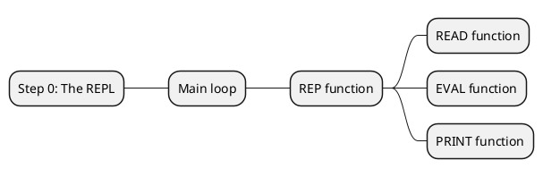
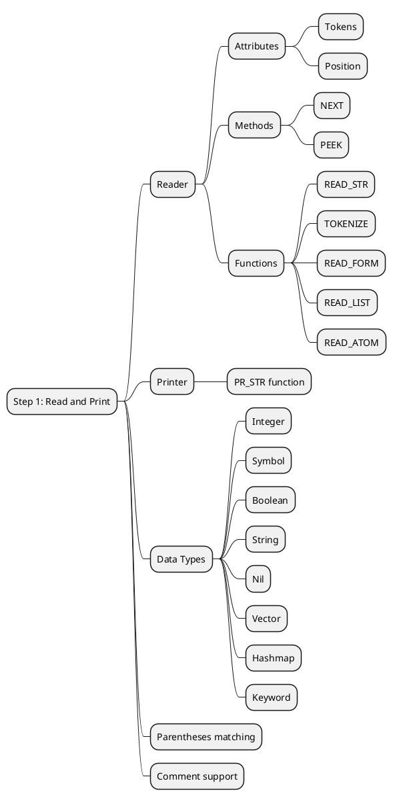
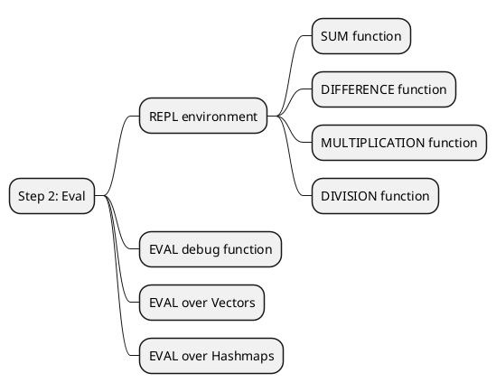
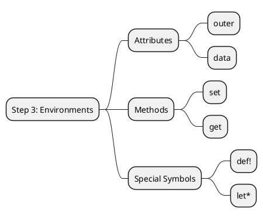
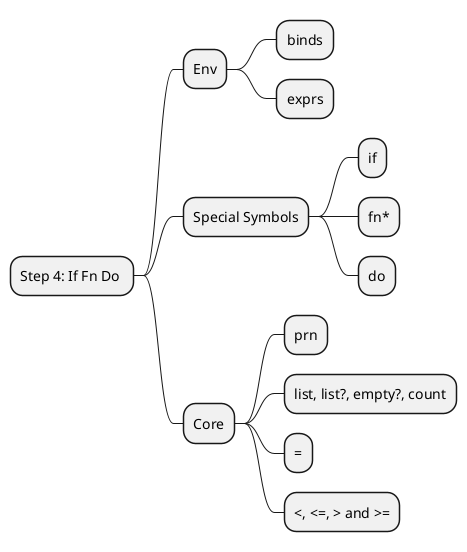

# mal
- [Make a Lisp](https://github.com/kanaka/mal)
- [Lisp](https://en.wikipedia.org/wiki/Lisp_(programming_language))

```plantuml
@startmindmap
# Step 0: The REPL
## Main loop
### REP function
#### READ function
#### EVAL function
#### PRINT function
@endmindmap
```

```plantuml
@startmindmap
# Step 1: Read and Print
## Reader
### Attributes
#### Tokens
#### Position
### Methods
#### NEXT
#### PEEK
### Functions
#### READ_STR
#### TOKENIZE
#### READ_FORM
#### READ_LIST
#### READ_ATOM
## Printer
### PR_STR function
## Data Types
### Integer
### Symbol
### Boolean
### String
### Nil
### Vector
### Hashmap
### Keyword
## Parentheses matching
## Comment support
@endmindmap
```

```plantuml
@startmindmap
# Step 2: Eval
## REPL environment
### SUM function
### DIFFERENCE function
### MULTIPLICATION function
### DIVISION function
## EVAL debug function
## EVAL over Vectors
## EVAL over Hashmaps
@endmindmap
```

```plantuml
@startmindmap
# Step 3: Environments
## Attributes
### outer
### data
## Methods
### set
### get
## Special Symbols
### def!
### let*
@endmindmap
```

```plantuml
@startmindmap
# Step 4: If Fn Do 
## Env
### binds
### exprs
## Special Symbols
### if
### fn*
### do
## Core
### prn
### list, list?, empty?, count
### =
### <, <=, > and >=
@endmindmap
```
