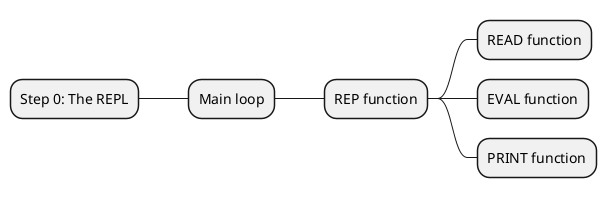
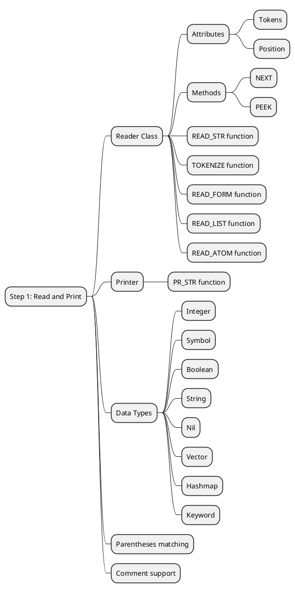

# mal
[Make a Lisp](https://github.com/kanaka/mal)

```plantuml
@startmindmap
# Step 0: The REPL
## Main loop
### REP function
#### READ function
#### EVAL function
#### PRINT function
@endmindmap
```

```plantuml
@startmindmap
# Step 1: Read and Print
## Reader Class
### Attributes
#### Tokens
#### Position
### Methods
#### NEXT
#### PEEK
### READ_STR function
### TOKENIZE function
### READ_FORM function
### READ_LIST function
### READ_ATOM function
## Printer
### PR_STR function
## Data Types
### Integer
### Symbol
### Boolean
### String
### Nil
### Vector
### Hashmap
### Keyword
## Parentheses matching
## Comment support

@endmindmap
```
